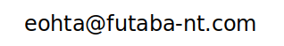

### Hi there 👋

I'm Eiji Ota, a freelance data scientst / algorithm developer from Japan.

I'm not very familiar with the open source development culture or the github system, so if you find any bugs in my repository or have any advice, please feel free to send me an email.

<!--
**eohta/eohta** is a ✨ _special_ ✨ repository because its `README.md` (this file) appears on your GitHub profile.

Here are some ideas to get you started:

- 🔭 I’m currently working on ...
- 🌱 I’m currently learning ...
- 👯 I’m looking to collaborate on ...
- 🤔 I’m looking for help with ...
- 💬 Ask me about ...
- 📫 How to reach me: ...
- 😄 Pronouns: ...
- ⚡ Fun fact: ...
-->
